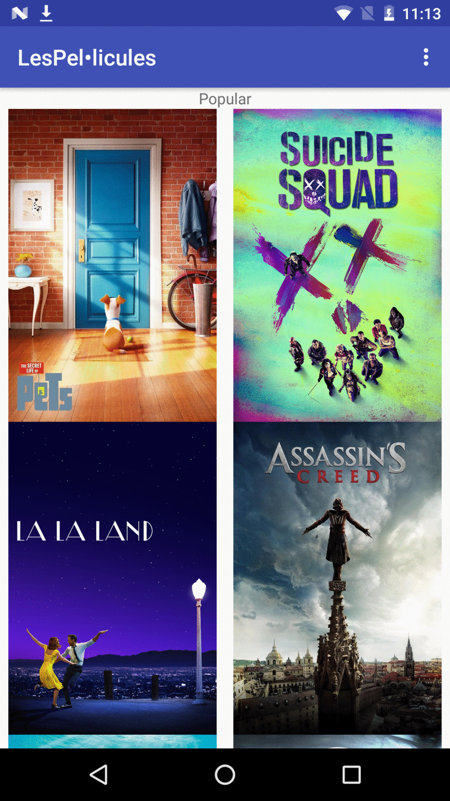

# Les Pel•licules
Project1 of the Android nanodegree (from Udacity by google).

In this Android app that the user will be able to request information regarding the movies marked from the the theMovieDB. The user will be able to request movies such as: Top Rated, Now Playing, Upcoming ... From those, the user will  see relevant information regarding to the selected movie such as: movie brief, trailers, reviews... It also contains the functionality to save favourite movies in your device so you can check them whenever you want.

Key points to highlight:

- Working in MVVM architecture.
- Interconnected activities.
- Working with fragments (so it is going to be easier if we want to develop a tablet version of the app).
- ContentProvider/ ContentResolver to feed the app with the saved data, or being able to share the data with others apps.
- SQlite data base to save internally the favourites movies.
- You can find the final solution in the google play [here](https://play.google.com/store/apps/details?id=cat.jorda.xavier.lespellicules)

Relevant UI components that we can find in this proejct:

- Grid View
- Reltive Layout
- List View
- DialogFragment
- menu

